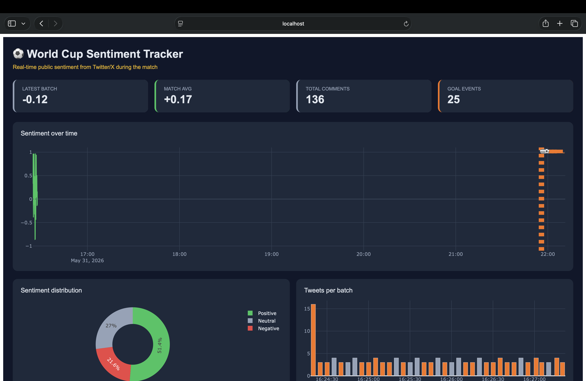

<div align="center">

# ⚽ World Cup Sentiment Tracker

### Real-Time Match Sentiment Analysis using Reddit, HuggingFace & Plotly Dash

Stream live Reddit comments → NLP inference → Interactive live dashboard


</div>

---

## Overview

During a World Cup match, thousands of Reddit comments flood r/soccer every minute. This project taps into that live stream and answers one question in real time:

> **How does public sentiment shift the moment a goal is scored?**

Comments are pulled from Reddit using PRAW, classified as positive, neutral, or negative using a fine-tuned RoBERTa transformer model, aggregated into 5-second windows, and rendered on a live Plotly Dash dashboard — with automatic goal annotations every time a scoring event is detected from keyword spikes.

---

## Dashboard Preview



The dashboard shows:
- **KPI cards** — latest sentiment score, match average, total comments processed, goal events detected
- **Sentiment timeline** — live line chart with orange ⚽ GOAL markers at detected goal events
- **Sentiment distribution** — donut chart showing positive / neutral / negative breakdown
- **Comments per batch** — volume bar chart with goal batches highlighted in orange

---

## How It Works

```
Reddit Stream (PRAW)
      │
      ▼
Keyword Filter ──► Thread-Safe Deque (maxlen 2,000)
                          │
                          ▼
              HuggingFace RoBERTa Inference
              cardiffnlp/twitter-roberta-base-sentiment-latest
              (batches of 16, output mapped to [-1, +1])
                          │
                          ▼
              Goal Event Detector
              (flags batch if >25% contain goal keywords)
                          │
                          ▼
           Plotly Dash Dashboard (refreshes every 5 seconds)
      ┌───────────┬────────────┬────────────┐
  Timeline     Donut       Volume       KPIs
  + Goals    Pos/Neu/Neg   Per batch   4 cards
```

### Sentiment Score Formula

The model outputs three probabilities — negative, neutral, positive. These are collapsed into a single continuous score:

```
score = prob(Positive) − prob(Negative)    →    range [−1, +1]
```

A score near +1 means overwhelmingly positive (just after a goal for your team). Near -1 means very negative (controversial referee decision). Near 0 is ambiguous or neutral.

---

## Tech Stack

| Layer | Technology | Purpose |
|---|---|---|
| Data ingestion | PRAW + Reddit API | Stream live comments |
| Concurrency | Python `threading` | Non-blocking stream + dashboard |
| Queue | `collections.deque` | Thread-safe comment buffer |
| NLP model | HuggingFace Transformers | Sentiment classification |
| Deep learning | PyTorch | Model inference backend |
| Dashboard | Plotly Dash | Live interactive visualisation |
| Config | python-dotenv | Credential management |

---

## ML Concepts Applied

| Concept | Description | Where in code |
|---|---|---|
| **Transfer learning** | Uses a pre-trained RoBERTa model — no training from scratch | `analyser.py` — `from_pretrained()` |
| **Fine-tuning** | Model was fine-tuned by Cardiff NLP on 124M+ tweets | `MODEL_NAME` constant |
| **Transformer architecture** | Self-attention for contextual understanding | Inside the loaded model |
| **Tokenisation** | Subword tokenisation, padding, truncation to 128 tokens | `_score_texts()` |
| **Softmax** | Converts raw logits to probabilities summing to 1 | `F.softmax()` in `analyser.py` |
| **Batch inference** | Processes 16 comments at once for efficiency | `BATCH_SIZE = 16` |
| **Temporal smoothing** | Averages scores per 5-second window to reduce noise | `process_batch()` |
| **Event detection** | Detects goal events from keyword frequency spikes | `_detect_goal()` |
| **NLP preprocessing** | Normalises URLs and @mentions before inference | `_preprocess()` |

---

## Project Structure

```
worldcup-sentiment/
│
├── app.py                  # Entry point — wires stream, analyser, dashboard
├── requirements.txt        # All dependencies
├── .env.example            # Credentials template
├── .gitignore
├── assets/
│   └── preview.png         # Dashboard screenshot
└── src/
    ├── __init__.py
    ├── streamer.py         # Reddit PRAW stream → deque
    ├── analyser.py         # HuggingFace inference + goal detection
    └── dashboard.py        # Plotly Dash layout + live callbacks
```

### File responsibilities

**`app.py`** — The entry point. Creates the shared deque, starts the stream in a daemon thread, initialises the analyser, and launches the Dash server. Accepts `--mock`, `--port`, and `--debug` flags.

**`src/streamer.py`** — Connects to Reddit via PRAW. Streams comments from `r/soccer+worldcup+football`, filters by match keywords, and pushes dicts into the shared deque. Includes `start_match_thread_stream()` for targeting a specific live match thread, and `start_mock_stream()` for offline development.

**`src/analyser.py`** — Loads the HuggingFace model on init. Exposes `process_batch()` which drains the queue, runs inference in batches, detects goal events, and stores a rolling history of `SentimentPoint` dataclasses. `get_history()` and `get_goal_events()` are called by the dashboard.

**`src/dashboard.py`** — Defines the Dash layout and a single callback wired to `dcc.Interval`. Rebuilds all four charts and KPI cards every 5 seconds from the analyser's history. Goal events are rendered as annotated vertical lines on the sentiment timeline.

---

## Quick Start

### 1 — Clone and install

```bash
git clone https://github.com/YOUR_USERNAME/worldcup-sentiment.git
cd worldcup-sentiment
pip install -r requirements.txt
```

> The first run automatically downloads the RoBERTa model (~500 MB) from HuggingFace Hub and caches it locally. Subsequent runs load from cache instantly.

### 2 — Try it immediately with mock data

No credentials needed:

```bash
python app.py --mock
```

Open **http://localhost:8050** — you will see the full live dashboard with simulated match comments and goal events.

### 3 — Run with live Reddit data

```bash
cp .env.example .env
# Open .env and add your Reddit credentials
python app.py
```

---

## Environment Variables

Create a `.env` file in the project root (never commit this):

```env
REDDIT_CLIENT_ID=your_client_id_here
REDDIT_CLIENT_SECRET=your_client_secret_here
REDDIT_USER_AGENT=WorldCupSentimentTracker/1.0
```

Get credentials at **reddit.com/prefs/apps**:
1. Click "create another app"
2. Select type: **script**
3. Redirect URI: `http://localhost:8080`
4. Grant **read-only** scopes only (Read Content + My Identity)

---

## Run Options

```bash
# Live Reddit stream (requires .env credentials)
python app.py

# Offline mock mode — no credentials, full dashboard
python app.py --mock

# Custom port
python app.py --port 8080

# Dash debug mode (hot reload)
python app.py --debug

# Combine flags
python app.py --mock --debug --port 8080
```

---

## Targeting a Specific Match Thread

For a live match, streaming a single r/soccer match thread gives much higher volume and a cleaner signal. Find the match thread URL on r/soccer at kickoff, then update `app.py`:

```python
from src.streamer import start_match_thread_stream

stream_fn = lambda: start_match_thread_stream(
    tweet_queue,
    thread_url="https://www.reddit.com/r/soccer/comments/THREAD_ID/match_thread_..."
)
```

Match threads on r/soccer typically receive 50,000–200,000 comments during a major game.

---

## Customisation

| What to change | File | Variable |
|---|---|---|
| Subreddits to monitor | `streamer.py` | `SUBREDDITS` |
| Match keywords | `streamer.py` | `MATCH_KEYWORDS` |
| Dashboard refresh rate | `dashboard.py` | `REFRESH_MS` |
| Sentiment model | `analyser.py` | `MODEL_NAME` |
| Goal detection sensitivity | `analyser.py` | `0.25` threshold in `_detect_goal()` |
| Inference batch size | `analyser.py` | `BATCH_SIZE` |

---

## Security

- `.env` is listed in `.gitignore` — credentials are never committed
- Reddit OAuth scoped to **read-only** permissions only
- No comment text or user data stored permanently — everything processed in memory

---

## Requirements

```
Python 3.10+
praw>=7.7.0
transformers>=4.38.0
torch>=2.0.0
dash>=2.16.0
plotly>=5.19.0
pandas>=2.0.0
python-dotenv>=1.0.0
```

---

## What I Learned

- Designing a **multi-threaded data pipeline** with a shared thread-safe buffer
- Applying **transfer learning** with a pre-trained transformer for NLP inference
- Building a **real-time reactive dashboard** using Dash callbacks and interval components
- Handling **stream reconnection logic** and production-style error handling
- Applying **least-privilege security** principles to API credential scoping
- Managing **environment configuration** cleanly with dotenv

---

## Future Improvements

- [ ] Export sentiment history to CSV after each match
- [ ] Deploy to Render or Railway for a public live URL
- [ ] Add team-specific sentiment tracking (separate scores per team)
- [ ] Add a match timeline scrubber to replay sentiment history
- [ ] Support multiple concurrent match threads

---

## License

MIT — free to use, modify, and distribute.

---

<div align="center">
Built by <strong>Shishir Kant Upadhyay</strong> &nbsp;·&nbsp; B.Tech CSE &nbsp;·&nbsp; VIT Bhopal
<br><br>
Registration No: 24BCE11360
</div>
